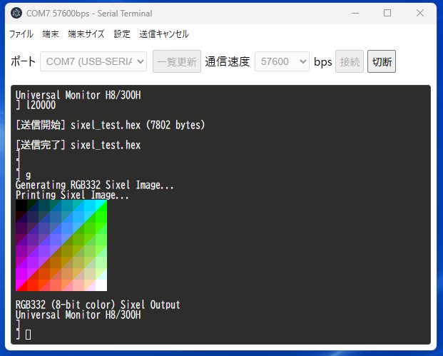
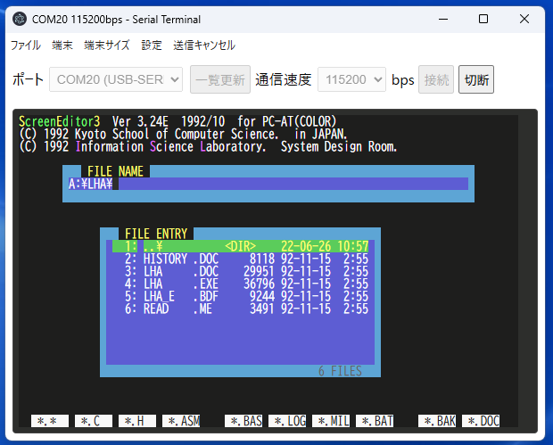

# SerialTerminal

ターミナルに画像を表示する Sixel に対応したシリアルターミナルプログラムです。Electron を使用してクロスプラットフォームで動作します。

## スクリーンショット

 

## 使い方
1. [Releases](https://github.com/nkito/serial-terminal/releases) から適切なバージョンをダウンロードしてください。
2. ダウンロードしたファイルを解凍し、アプリケーションを起動してください。
3. シリアルポートを選択し、ボーレートを設定して接続してください。

## 開発
このプロジェクトは Electron を使用して開発されています。開発環境をセットアップするには、以下の手順を実行してください。
1. Node.js をインストールしてください。
2. プロジェクトのルートディレクトリで以下のコマンドを実行して依存関係をインストールしてください。
```bash
npm install
```
3. アプリケーションをビルドするには、以下のコマンドを実行してください。
```bash
npm run build
```
以下のコマンドで実行ファイルを作ることができます。
```bash
npm run dist:win
```
